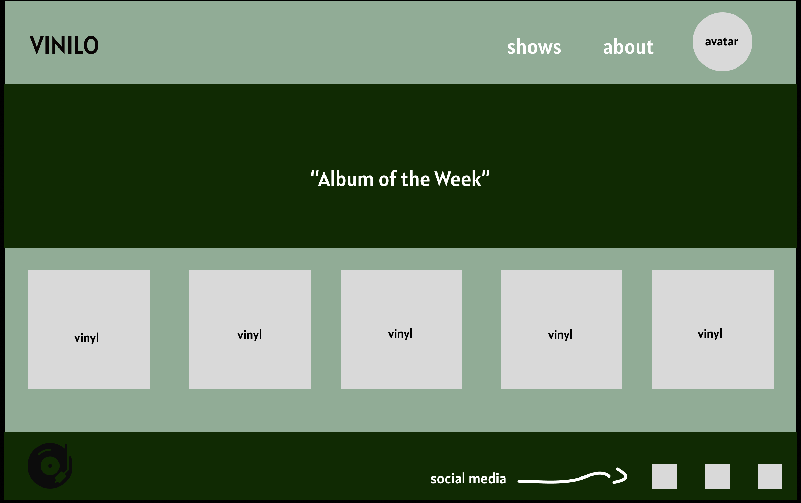
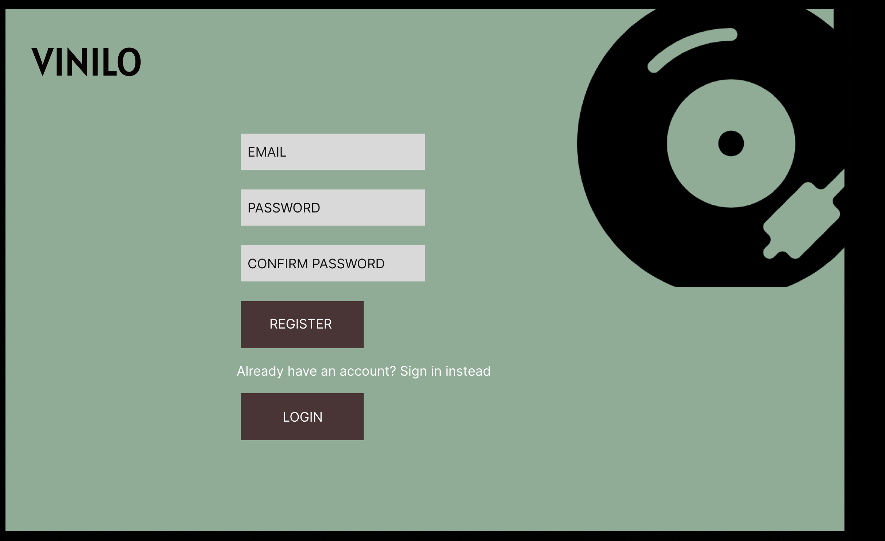
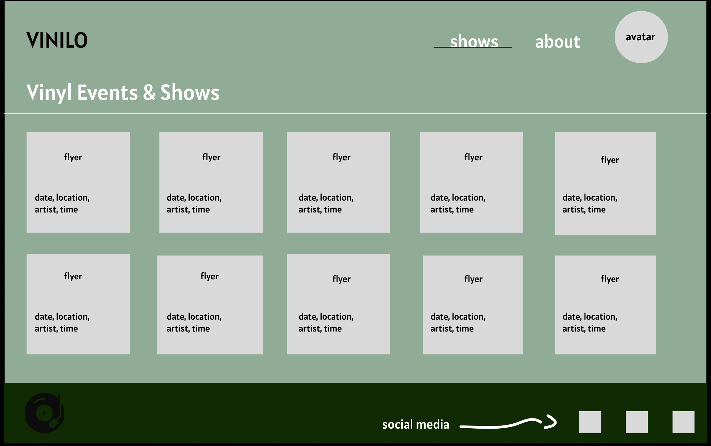
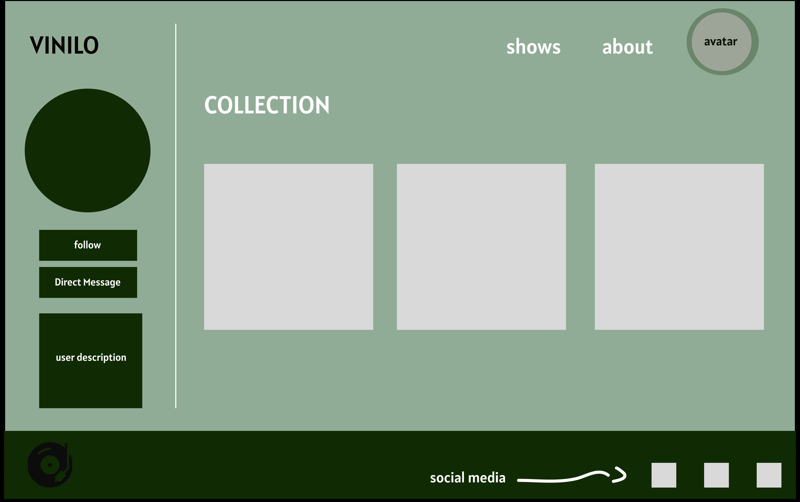
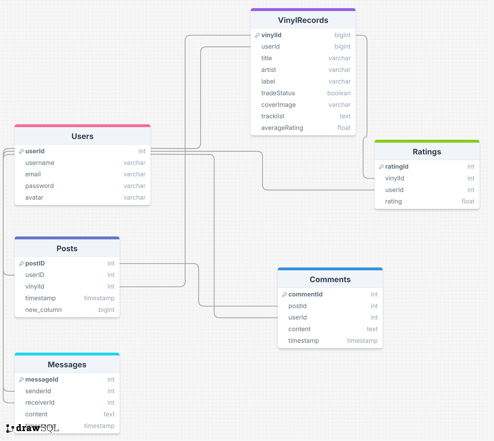
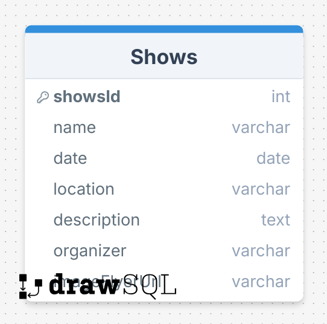

# Project Title

Vinilo

## Overview

Vinilo is a social media platform for vinyl collectors to share their collections, connect with other enthusiasts, and discover vinyl-related events and shows.


### Problem

Vinyl collectors often struggle to discover like-minded individuals, showcase their collections, and stay informed about vinyl-related events or shows in an engaging, interactive space. Existing platforms lack the tailored social and event discovery features collectors need.

### User Profile

- Vinyl Collectors:
    - looking to showcase their collection to a community of enthusiasts.
    - interested in trading, buying, or showcasing their records.
    - want to discover vinyl-related events and gigs nearby.

### Features

- As a user, I want to be able to create an account to manage my profile.

- As a user, I want to be able to log in to my account to update my collection, manage my posts, and interact with other collectors.

- As a logged-in user, I want to upload vinyl records to my collection with details such as album title, artist, label, and tracklist.

- As a logged-in user, I want to browse my collection, where each vinyl is displayed as a card with hoverable audio previews of one of its tracks.

- As a logged-in user, I want to toggle an “Open to Trade” status for each vinyl to indicate if I'm open to trading that record.

- As a logged-in user, I want to view detailed information about a vinyl in my collection, including a 5-star rating system, reviews, and a comment section.

- As a logged-in user, I want to like and comment on posts in the feed to interact with other collectors.

- As a logged-in user, I want to follow other collectors to see their posts in my feed.

- As a logged-in user, I want to browse a “Shows” section to discover upcoming vinyl-related events, including details such as the event name, date, location, and description.

- As a logged-in user, I want to send direct messages to other collectors for private communication.


## Implementation

### Tech Stack

- React
- Vanilla Javascript
- MySQL
- Express
- Client libraries: 
    - react
    - react-router
    - react-modal
    - sass
    - axios
    - howler
    
- Server libraries:
    - knex
    - cors
    - dotenv
    - express
    - mysql2
    - uuid


### APIs

- No external APIs will be used for the first sprint

### Sitemap

- Login (/login)
- Register (/register)
- HomePage (/) 
- About (/about)
- Shows (/shows)
- Profile (/username)
- Collection (/username/collection/:id)
- Direct Messages (/username/messages/:id)

### Mockups

#### Home Page


#### Register Page


#### Login Page


#### About Page


#### Shows Page


#### Profile Page (with Collection displayed)


#### Direct Message Page


### Data




### Endpoints

### Authentication

**POST /register**

- Register a new user.

Parameters:
- email (string): the user's email address
- password (string): The user's password
- username (string): The user's chosen username


Response:
```
{
  "success": true,
  "message": "User registered successfully",
  "token": "JWT_TOKEN_HERE"
}
```

**POST /login**

- Authenticate a user and issue a JWT.

Parameters:
- email (string): The user's email address
- password (string): The user's password

Response:
```
{
  "success": true,
  "message": "Login successful",
  "token": "JWT_TOKEN_HERE"
}
```

### Homepage

**GET /**

- Fetch random vinyls for "Vinyl of the week."

Parameters:
- 

Response:
```
[
  {
    "id": 1,
    "title": "Dark Side of the Moon",
    "artist": "Pink Floyd",
    "coverImage": "vinyl-cover-url.jpg",
    "previewTrack": "track-preview-url.mp3"
  },
  ...
]
```

### About Page

**GET /about**

- Fetch information about the app and its mission

Parameters:
- none (public endpoint, no authentication required)

Response:
```
{
  "platformName": "Vinilo",
  "mission": "To connect vinyl collectors worldwide, enabling them to share their collections, discover new records, and build a vibrant community.",
  "features": [
    "Showcase your vinyl collection to a global audience.",
    "Discover and RSVP to vinyl-related events and gigs.",
    "Rate and review records with a 5-star rating system.",
    "Follow other collectors and interact through likes, comments, and messages."
  ],
  "communityStats": {
    "totalUsers": 12000,
    "totalVinylsShared": 50000,
    "eventsListed": 120,
    "countriesRepresented": 75
  },
  "developerNote": "Vinilo is built by a team of passionate vinyl enthusiasts aiming to bring collectors together. We’re constantly adding new features to enhance your experience."
}

```

**GET /shows**

- Display a list of upcoming vinyl-related events.

Parameters:

- None

Response:
```
[
  {
    "id": 1,
    "name": "Vinyl Fest 2024",
    "date": "2024-12-10",
    "location": "Los Angeles, CA",
    "description": "The largest vinyl event on the West Coast."
  },
  ...
]
```

**GET /shows/:id**

- Displays details for a specific show

Parameters:
- id (integer): The unique identifier of the show

Response:
```
{
  "id": 1,
  "image_flyer_url": "https://example.com/images/vinyl-fest-2024-flyer.jpg" 
  "name": "Vinyl Fest 2024",
  "date": "2024-12-10",
  "location": "Los Angeles, CA",
  "description": "The largest vinyl event on the West Coast.",
  "organizer": "Vinyl Enthusiasts Group"
}
```

### Profile

**GET /username**

- Fetch user profile details

Parameters:
- token (string): JWT token for authenticating the logged-in user.

Response:
```
{
  "id": 1,
  "username": "vinylfanatic",
  "bio": "Lover of rare records and trades.",
  "avatar": "profile-pic-url.jpg",
  "stats": {
    "vinylCount": 50,
    "followers": 120,
    "following": 85
  }
}
```

### Collection

**GET /username/collection/**

- Fetch user's vinyl collection.

Parameters:
- token (string): JWT token for authenticating the logged-in user.

Response:
```
[
  {
    "id": 1,
    "title": "Abbey Road",
    "artist": "The Beatles",
    "coverImage": "vinyl-cover-url.jpg",
    "tradeStatus": "open",
    "averageRating": 4.9
  },
  ...
]
```

**GET /username/collection/:id**

- Fetch details of a specific vinyl in the user’s collection.

Parameters:
- id (integer): The unique identifier of the vinyl.
- token (string): JWT token for authenticating the logged-in user.

```
{
  "id": 1,
  "title": "Abbey Road",
  "artist": "The Beatles",
  "label": "Apple Records",
  "description": "A classic album by The Beatles.",
  "tracklist": [
    "Come Together",
    "Something",
    "Maxwell's Silver Hammer"
  ],
  "averageRating": 4.9,
  "totalRatings": 45,
  "reviews": [
    {
      "id": 1,
      "username": "recordlover",
      "content": "Timeless masterpiece.",
      "timestamp": "2024-11-15T14:00:00Z"
    }
  ]
}
```

**GET /username/messages/:id**

- Fetch all messages in a specific conversation.

Parameters:
- id (integer): The unique identifier of the conversation.
- token (string): JWT token for authenticating the logged-in user.

```
[
  {
    "id": 1,
    "sender": "vinylfanatic",
    "receiver": "recordlover",
    "content": "Hey, are you interested in trading this vinyl?",
    "timestamp": "2024-11-18T10:00:00Z"
  },
  ...
]
```

**POST /username/messages/:id**

- Send a message to user.

Parameters:
- receiverId (integer): The ID of the user receiving the message.
- content (string): The text content of the message.

```
{
  "receiverId": 2,
  "content": "Let’s trade records!"
}
```

Response:
- 

```
{
  "success": true,
  "message": "Message sent successfully"
}
```

### Auth

- JWT auth
    - Before adding auth, all API requests will be using a fake user with id 1
    - Added after core features have first been implemented
    - Store JWT in localStorage, remove when a user logs out
    - Add states for logged in showing different UI in places listed in mockups

## Roadmap

- Data Setup (mySQL)
    - Design and create the schema for tables: Users, VinylRecords, Posts, Comments, Shows, Ratings, and Messages

- Backend Development
    - create an Express server and set up routes with placeholder responses

- Create migrations

- Gather a diverse collection of vinyl records (e.g., 15-30 entries)

- Create seeds with sample comments, shows, and messages for testing

- Deploy client and server projects so all commits will be reflected in production

- Feature: Create account
    - Implement the POST /register endpoint to allow users to sign up
    - Create POST /login endpoint to authenticate users and issue JWT tokens
    - Design a responsive Register and Login page in React with form validation
    - Store tokens in localStorage and manage authentication states in the frontend

- Feature: Home Page
    - Implement the GET / endpoint to fetch random vinyls for "Vinyl of the Week"
    - Design the Home Page with a hero section and its details, as well navigation links to About, Profile and Shows.

- Feature: User Profile
    - Implement the GET /username endpoint to fetch user profile details (bio, avatar, stats, etc.)
    - Build the profile page to route to Collections and other route to Direct Messages

- Feature: Vinyl Collection
    - Implement the GET /username/collection and display vinyl records as cards with hoverable track previews
    - Add an "Open to Trade" toggle on each card
    - Implement the GET /username/collection/:id to display vinyl cover, album title, artist, label, description, trakclist and reviews
    - Review section with comment edit/delete options

- Feature: Vinyl-Related Events
    - Implement the /shows endpoint to display vinyl shows with flyer, event name, description, organizer and RSVP button

- Feature: Direct Messaging
    - Implement the GET /username/messages/:id endponit to display conversation in a sidebar
    -Implement the POST /username/messages/:id to add functionality to send and delete messages

- Bug fixes

- DEMO DAY

## Nice-to-haves

- Real-Time Features
    - Notifications for likes, comments, and messages using WebSocket or Socket.IO
    - Live updates in the feed when new posts are added

- User Recommendations
    - Suggest users to follow based on shared interests or location

- Advanced Vinyl Management
    - Add filtering and sorting options for vinyl collections
    - Allow users to upload custom track previews

- Forgot password functionality# ariadna-toledo-vinilo-capstone
